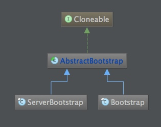

# 源代码阅读笔记之Bootstrap
----
## 简介

netty4提供的AbstractBootstrap是一个帮助类，它提供了一种Builder模式来配置AbstractBootstrap，主要用于在使用netty4作为Client
和Server时，帮助用于启动netty

** 先看AbstractBootstrap相关的类图:  **  

** AbstractBootstrap有两个子类: **   
* ServerBootstrap 用户使用netty作为Server时，辅助启动  
* Bootstrap 用于使用netty作为client时，辅助启动  

## ServerBootstrap

## BootStrap